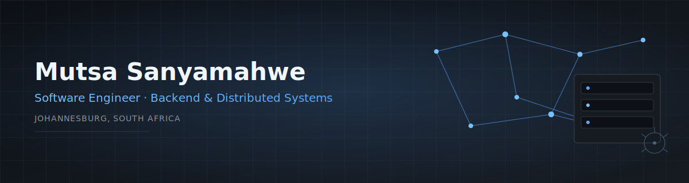

  

  

  
  
  
  

 

## About

Software Engineer based in Johannesburg, South Africa, with a BSc in Computer Science & Informatics (Distinction). I build complete backend systems rather than isolated features — with a focus on clear architectural boundaries, scalability, and correctness.

**Currently focused on:**

- Backend Engineering
- Distributed Systems
- System Design
- AI Engineering
- Machine Learning Systems

I document what I learn through public, well-structured repositories — I believe in **learning in public**.

 

## Tech Stack

**Languages**

**Backend**

**Frontend**

 &nbsp;

**Database**

**DevOps**

**Machine Learning**

 &nbsp; &nbsp;

 

## Featured Projects

<table>
<tr>
<td width="50%" valign="top">

### [DevVerify](https://github.com/your-username/devverify)

`FastAPI` `Docker` `GitHub API` `PostgreSQL`

Automated developer portfolio engine that analyzes CVs and GitHub repositories to generate verified developer profiles.

</td>
<td width="50%" valign="top">

### [DevMatch](https://github.com/your-username/devmatch)

`Node.js` `Express` `React` `PostgreSQL`

Developer matching platform powered by DevVerify, built for automated candidate onboarding.

</td>
</tr>
<tr>
<td width="50%" valign="top">

### [GitHub Repository Recommender](https://github.com/your-username/github-repo-recommender)

`Python` `Scikit-Learn` `FastAPI`

Machine learning recommendation engine trained on 900+ open-source repositories to surface relevant projects for developers.

</td>
<td width="50%" valign="top">

### [PawPal](https://github.com/your-username/pawpal)

`Full-Stack`

Pet services platform with booking, matching, geolocation, and training resources.

</td>
</tr>
</table>

 

## Pinned Repositories

  
  

  
  

 

## Currently Learning

Building a set of public repositories that cover:

- System Design
- Distributed Systems
- Data Structures & Algorithms
- Backend Engineering
- Cloud Computing

Each repository documents notes, diagrams, and working implementations as I go — learning in public, one commit at a time.

 

## GitHub Stats

  
  

  

 

## Contribution Graph

  

 

  Built with a focus on clarity, architecture, and shipping systems that scale.

